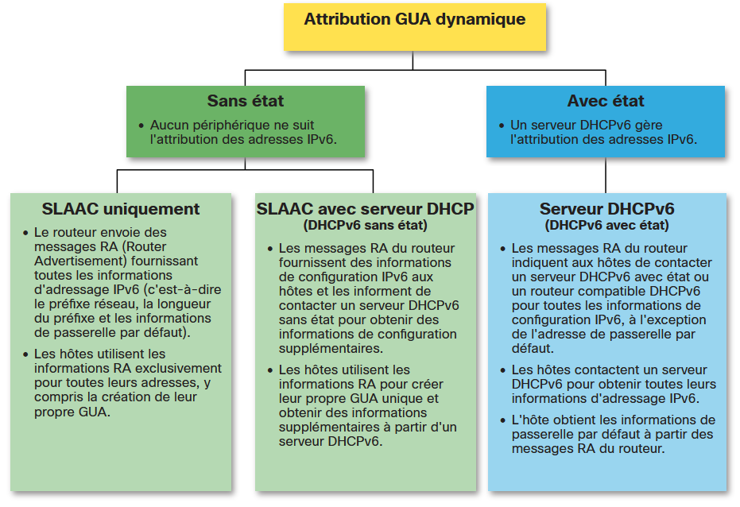

## 8.1.1 - Configuration des hôtes IPv6

Tout d'abord. Pour utiliser la configuration automatique d'adresses sans état (SLAAC) ou DHCPv6, vous devez consulter les adresses de monodiffusion globale (GUA) et les adresses locales de liaison (LLA). Cette rubrique couvre les deux.

Sur un routeur, une adresse de monodiffusion globale (GUA) IPv6 est configurée manuellement à l'aide de la commande de configuration ipv6 address ipv6-address/prefix-length interface.

Un hôte Windows peut également être configuré manuellement avec une configuration d'adresse GUA IPv6.

## 8.1.3 - Attribution de GUA IPv6

IPv6 a été conçu pour simplifier la façon dont un hôte peut acquérir sa configuration IPv6. Par défaut, un routeur compatible IPv6 annonce ses informations IPv6. Cela permet à un hôte de créer ou d'acquérir dynamiquement sa configuration IPv6.

La GUA IPv6 peut être affectée dynamiquement à l'aide de services sans état et avec état, comme le montre la figure.

Toutes les méthodes sans état et avec état dans ce module utilisent des messages RA ICMPv6 pour suggérer à l'hôte comment créer ou acquérir sa configuration IPv6. Bien que les systèmes d'exploitation hôtes suivent la suggestion de RA, la décision réelle revient finalement à l'hôte.

 

## 8.1.4 - Trois indicateurs de message RA

La décision de la façon dont un client obtiendra une GUA IPv6 dépend des paramètres du message RA.

Un message RA ICMPv6 comprend trois indicateurs permettant d'identifier les options dynamiques disponibles pour un hôte, comme suit:

 - Indicateur A - Il s'agit de l'indicateur Address Autoconfiguration. Utilisez l'autoconfiguration des adresses sans état (SLAAC) pour créer un GUA IPv6.
 - Indicateur O - Il s'agit de l'indicateur Autre configuration. D'autres informations sont disponibles à partir d'un serveur DHCPv6 sans état.
 - Indicateur M - Il s'agit de l'indicateur de configuration des adresses gérées. Utilisez un serveur DHCPv6 avec état pour obtenir une GUA IPv6.

En utilisant différentes combinaisons des indicateurs A, O et M, les messages RA informent l'hôte des options dynamiques disponibles.

## 8.2.1 - Aperçu de SLAAC

Tous les réseaux n'ont pas accès à un serveur DHCPv6. Mais chaque périphérique d'un réseau IPv6 a besoin d'une GUA. La méthode SLAAC permet aux hôtes de créer leur propre adresse de monodiffusion globale IPv6 unique sans les services d'un serveur DHCPv6.

SLAAC est un service sans état. Cela signifie qu'il n'y a pas de serveur qui conserve les informations d'adresse réseau pour savoir quelles adresses IPv6 sont utilisées et lesquelles sont disponibles.

Le SLAAC utilise les messages RA ICMPv6 pour fournir l'adressage et d'autres informations de configuration qui seraient normalement fournies par un serveur DHCP. Un hôte configure son adresse IPv6 en fonction des informations envoyées dans le RA. Les messages RA sont envoyés par un routeur IPv6 toutes les 200 secondes.

Un hôte peut également envoyer un message de sollicitation du routeur (RS) demandant qu'un routeur compatible IPv6 envoie un RA à l'hôte.

SLAAC peut être déployé en tant que SLAAC uniquement, ou SLAAC avec DHCPv6.

## 8.2.2 - Activation de la SLAAC

```
conf t
ipv6 unicast-routing
```

Vérification d'activation:

```
show ipv6 interface G0/0/1 | section Joined
```

## 8.2.3 - Méthode SLAAC uniquement

La méthode SLAAC uniquement est activée par défaut lorsque la commande ipv6 unicast-routing est configurée. Toutes les interfaces Ethernet activées avec une GUA IPv6 configurée commenceront à envoyer des messages RA avec l'indicateur A défini sur 1, et les indicateurs O et M définis sur 0.

